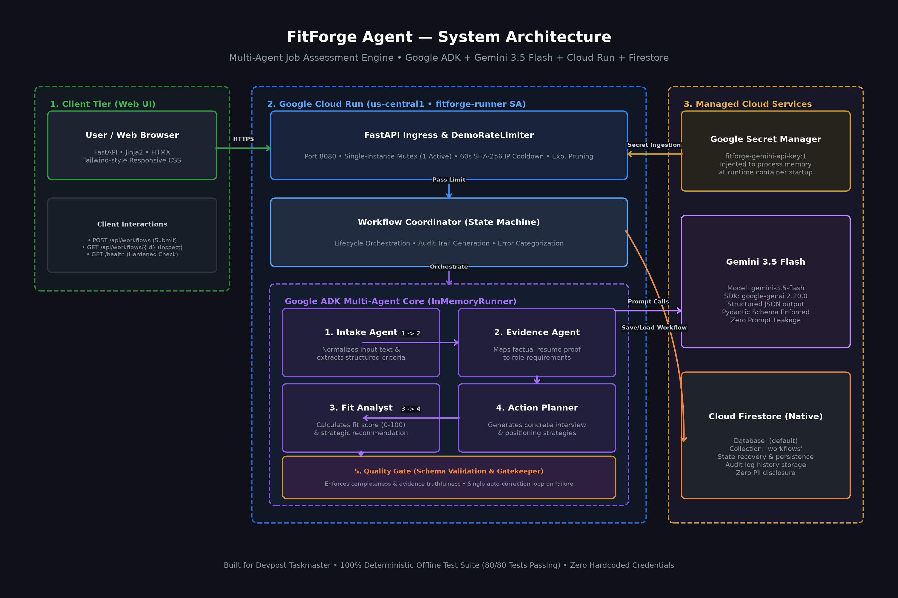

# FitForge Agent — Evidence-Based Job Opportunity Assessment System

[](https://fitforge-agent-169201386255.us-central1.run.app)
[](https://github.com/google/agent-development-kit)
[](https://deepmind.google/technologies/gemini/)
[](tests/)
[](LICENSE)

FitForge Agent is an evidence-based job-opportunity assessment multi-agent system built for the **Google Agentic AI Hackathon (Taskmaster Category)**. It converts a candidate's résumé, target job description, and career priorities into an objective career intelligence report featuring an actionable recommendation (`Pursue`, `Investigate`, `Pass`), transparent fit score (0–100), requirement-to-evidence proof matrix, gap analysis, and tailored interview positioning strategies.

---

## 🏛️ System Architecture



FitForge operates as a coordinated 5-specialist agent pipeline orchestrated through the **Google Agent Development Kit (ADK)**:

```
[Raw Inputs: Résumé + Job Description + Priorities]
                         │
                         ▼
             ┌───────────────────────┐
             │     Intake Agent      │  ──> Normalizes text, parses sections & flags missing criteria
             └───────────────────────┘
                         │
                         ▼
             ┌───────────────────────┐
             │    Evidence Agent     │  ──> Extracts requirements, maps evidence (direct, transferable, gap)
             └───────────────────────┘
                         │
                         ▼
             ┌───────────────────────┐
             │      Fit Analyst      │  ──> Computes 0-100 fit score, checks non-negotiables & recommends Pursue/Investigate/Pass
             └───────────────────────┘
                         │
                         ▼
             ┌───────────────────────┐
             │    Action Planner     │  ──> Generates application brief, next actions, questions & STAR interview prep
             └───────────────────────┘
                         │
                         ▼
             ┌───────────────────────┐
             │     Quality Gate      │  ──> Audits unsupported claims, contradictions & enforces max 1 correction pass
             └───────────────────────┘
                         │
                         ▼
             [Completed Assessment & Timestamped Audit Trail]
```

### Specialist Agent Stages

1. **Intake Agent (`normalizing`)**: Standardizes unstructured text into structured candidate and opportunity specifications while preserving original content semantics.
2. **Evidence Agent (`mapping_evidence`)**: Extracts explicit role requirements and maps line-by-line factual résumé quotes (`direct`, `transferable`, `inference`, `missing`) without inventing experience.
3. **Fit Analyst (`scoring_fit`)**: Calculates an objective 0–100 score across operational, leadership, and financial domains, assessing non-negotiables to deliver an unambiguous recommendation (`Pursue`, `Investigate`, `Pass`).
4. **Action Planner (`planning_actions`)**: Synthesizes high-impact interview positioning narratives, vulnerability defense talking points, and targeted diligence questions.
5. **Quality Gatekeeper (`validating`)**: Validates evidence grounding against candidate text, ensures Pydantic schema completeness, and executes a single auto-correction cycle if inconsistencies arise.

---

## 🛠️ Google Technologies Proven in Implementation

* **Google Agent Development Kit (ADK)**: Multi-agent choreography and state machine lifecycle via `InMemoryRunner`.
* **Gemini 3.6 Flash (`gemini-3.6-flash`)**: Multi-stage reasoning and Pydantic-enforced structured JSON output via `google-genai 2.20.0`.
* **Google Cloud Run**: Fully managed serverless deployment in `us-central1` with automated scale-to-zero, request-based CPU allocation, and single-instance concurrency lock.
* **Google Cloud Firestore (Native Mode)**: Atomic persistence for workflow states and audit logs in the `(default)` database.
* **Google Secret Manager**: Zero-disk credential injection at container startup (`fitforge-gemini-api-key:1`).

---

## 🌐 Public Demo & Health Endpoints

* **Hosted Web Application**: [https://fitforge-agent-169201386255.us-central1.run.app](https://fitforge-agent-169201386255.us-central1.run.app)
* **Hardened Health Endpoint**: [https://fitforge-agent-169201386255.us-central1.run.app/health](https://fitforge-agent-169201386255.us-central1.run.app/health)
* **Synthetic Sample Benchmark**: [https://fitforge-agent-169201386255.us-central1.run.app/api/sample](https://fitforge-agent-169201386255.us-central1.run.app/api/sample)

---

## 💻 Local Setup & Reproducible Testing

### 1. Installation
```bash
git clone https://github.com/netguy47/fitforge-agent.git
cd fitforge-agent

python -m venv .venv
# On Windows:
.\.venv\Scripts\Activate.ps1
# On macOS/Linux:
source .venv/bin/activate

pip install -r requirements.txt
```

### 2. Run the Offline Test Suite
FitForge includes an automated **network socket tripwire** in `tests/conftest.py` guaranteeing that tests make zero external network or paid API calls:

```bash
pytest -v
```
*Expected Result: 80 passed in ~4.5s*

### 3. Launch Local Server (Deterministic Mode)
```bash
uvicorn app.main:app --host 127.0.0.1 --port 8000 --reload
```
Open **[http://127.0.0.1:8000](http://127.0.0.1:8000)** and click **Load Sample** to run a synthetic benchmark assessment.

---

## 🔒 Security, Privacy & Cost Controls

* **Zero Hardcoded Credentials**: API keys and service tokens are excluded from Git and injected via Google Secret Manager.
* **IP Privacy & Masking**: All client IP addresses are immediately hashed via SHA-256 and truncated to 16 characters. Raw IPs are never logged or stored.
* **Demo Rate Limiter**: Process-level single-instance concurrency lock (`max 1 active run`) and 60-second client cooldown with automatic expired record pruning.
* **Least-Privilege Identity**: Service account `fitforge-runner` holds only `roles/datastore.user` and resource-scoped `roles/secretmanager.secretAccessor`.

---

## 📂 Repository Structure

```text
fitforge-agent/
├── app/
│   ├── main.py                  # FastAPI endpoints & hardened health check
│   ├── models.py                # Pydantic schemas, enums & state machine
│   ├── settings.py              # Configuration & execution mode validation
│   ├── coordinator.py           # Multi-agent orchestrator & state machine
│   ├── rate_limiter.py          # Demo rate limiter, IP masking & concurrency lock
│   ├── execution/               # Execution Adapter Pattern (ADK & Deterministic)
│   ├── prompts/                 # Specialist instructions & prompt injection defenses
│   ├── agents/                  # Specialist agent implementations
│   ├── repositories/            # Persistence Layer (In-Memory & Firestore)
│   ├── static/                  # JavaScript interactions & CSS styling
│   └── templates/               # Jinja2 HTML layouts & UI partials
├── docs/                        # Architecture diagrams, disclosures & submission media
├── samples/                     # Synthetic candidate benchmark datasets
├── tests/                       # 80 offline unit & integration tests
├── Dockerfile                   # Cloud Run container definition
├── DEPLOYMENT.md                # Cloud Run deployment documentation
└── README.md
```

---

## ⚖️ Limitations & Roadmap

* **In-Memory Rate Limiting**: The public demo utilizes an in-memory single-instance guard. Multi-region production will incorporate Google Cloud Armor and distributed Redis.
* **Decision Support Heuristic**: FitForge scores and recommendations provide objective alignment analysis and do not replace human career discernment or constitute legal employment advice.

---

## 📜 License
This project is licensed under the MIT License - see the [LICENSE](LICENSE) file for details.
